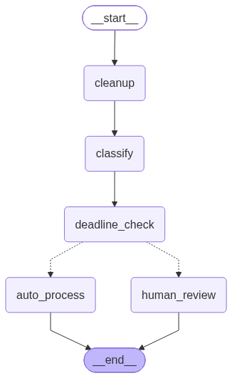

# LangChain/LangGraph Claims Triage Agent

A claims triage system built to learn LangChain and LangGraph from scratch, using an insurance-claims domain to stay consistent with the rest of my portfolio. The system takes a raw, messy claim description and a days-since-incident value, and returns a structured decision: auto-approve or flag for human review.

Built in progressive phases — each phase is a working, standalone script proving one core LangChain/LangGraph concept, culminating in a single combined pipeline (`05_langgraph_triage.py`) wrapped in a live FastAPI service (`06_api.py`).



## Stack

- **LangChain 1.3.15** — LCEL chains, prompt templates, output parsers, `create_agent`
- **LangGraph** (installed as a LangChain 1.0 dependency) — `StateGraph`, conditional edges, stateful branching
- **langchain-openai 1.5.1** — OpenAI model + embeddings integration
- **langchain-chroma 0.2.4 / chromadb 1.0.15** — vector store for policy document retrieval
- **FastAPI 0.136.1 / uvicorn 0.52.4** — live API wrapper
- **Python 3.12.10** (isolated venv — the system default was 3.14, which does not yet support LangGraph's dependency chain; see note below)

## Project structure

```
langchain-claims-triage/
├── src/
│   ├── 01_basic_chain.py        # Phase 1: single LCEL chain (cleanup)
│   ├── 02_multi_step_chain.py   # Phase 2: chained LCEL chains (cleanup → classify)
│   ├── 03_retriever.py          # Phase 3: Chroma vector store + retriever
│   ├── 04_agent_with_tools.py   # Phase 4: create_agent with tool-calling
│   ├── 05_langgraph_triage.py   # Phase 5: full LangGraph StateGraph pipeline
│   ├── 06_api.py                # FastAPI wrapper around the LangGraph pipeline
│   └── 07_graph_diagram.py      # Generates docs/claims_triage_graph.png
├── data/
│   ├── auto_policy.txt
│   ├── property_policy.txt
│   └── liability_policy.txt
├── docs/
│   └── claims_triage_graph.png
├── requirements.txt
├── .env.example
└── .gitignore
```

## Setup

```bash
python -m venv venv
source venv/bin/activate   # Windows: venv\Scripts\activate
pip install -r requirements.txt
cp .env.example .env       # then add your real OPENAI_API_KEY
```

Requires **Python 3.12**. See [Bugs & Lessons](#bugs--lessons) below for why.

**Run everything from the repo root**, not from inside `src/` — the scripts import each other as `src.05_langgraph_triage`, which only resolves correctly when Python's working directory is the project root.

```bash
# Build the vector store (run once, or whenever data/ changes)
python -m src.03_retriever

# Run the full LangGraph pipeline directly
python -m src.05_langgraph_triage

# Regenerate the graph diagram
python -m src.07_graph_diagram

# Start the live API
uvicorn src.06_api:app --reload
```

## Workflow logic

The finished pipeline (`05_langgraph_triage.py`) is a LangGraph `StateGraph` with five nodes:

1. **cleanup** — LCEL chain rewrites the raw claim into a clean, professional paragraph
2. **classify** — LCEL chain classifies TYPE (auto/property/liability) and SEVERITY (low/medium/high), hardened with explicit rules (e.g. any mentioned injury forces `SEVERITY: high` regardless of dollar amount) and few-shot examples
3. **deadline_check** — queries the real policy documents via a Chroma retriever, extracts the actual filing deadline from the retrieved text (not a hardcoded duplicate), and compares it against days-since-incident
4. **auto_process** / **human_review** — two terminal nodes; a plain Python router function (not an AI decision) reads the state after `deadline_check` and routes to whichever branch applies

**Routing rule:** if the claim is past its filing deadline OR severity is high, route to `human_review`. Otherwise, `auto_process`.

The retriever (built in Phase 3) is reused across the pipeline — one Chroma vector store built once from the three sample policy documents, reconnected to on disk (`./chroma_db`) by every later script and by the API.

## API

- `GET /health` — basic liveness check
- `POST /triage-claim` — accepts `{raw_claim, days_since_incident}`, runs the full LangGraph pipeline, returns the structured decision

## Error handling & known limitations

- **Deadline extraction has a fallback, not a hard failure path.** If the AI fails to extract a valid number from the retrieved policy text, the node falls back to a hardcoded `DEADLINES` dictionary rather than erroring. This keeps the pipeline from crashing on a bad extraction, but it means a malformed policy document could silently fall back to a possibly-wrong number without visibly flagging that the fallback was used. A production version should log a warning when the fallback path fires, not just silently use it.
- **No persistent conversation memory.** Each claim is processed independently — intentional for this use case (each claim genuinely is a fresh, independent event), but it means the system has no built-in way to handle a claim referencing a prior conversation.
- **Single-turn only, no streaming.** The API returns the full result in one response rather than streaming tokens back — acceptable for structured decision output, but a deliberate scope choice, not an oversight.
- **Prompts are hardened for the cases tested, not exhaustively.** The classify prompt has explicit rules and examples for the injury-severity edge case specifically, since that was identified as the highest-consequence edge case (a compliance-relevant one). Other edge cases (e.g. claims that don't clearly fit any of the three policy types) exist as a rule but haven't been stress-tested against a wide range of adversarial inputs.

## Bugs & Lessons

**System Python (3.14) breaks LangGraph's dependency chain.** Fresh `pip install langgraph` failed with dependency resolution errors before any project code was written. The system's default Python was 3.14 — too new. LangGraph's dependency chain (via `langchain-core` and related packages) doesn't yet support 3.14; several transitive dependencies pin to older Python version ranges.

Fix: created an isolated virtual environment pinned to Python 3.12.10 specifically for this project, instead of trying to force-resolve the conflict on the system interpreter.

Lesson: fast-moving AI/ML Python libraries often lag behind the newest language version by months. Check a library's supported Python range *before* assuming a dependency error is a problem with the requirements list itself — start a fresh, older-pinned venv first rather than debugging install errors on the newest interpreter.

## Testing

**Confirmed working:**
- Auto-approve path: routine claim, within deadline, low/medium severity → correctly routes to `auto_process`
- Human-review override: claim mentioning an injury described as "minor" → severity rule correctly overrides to high, routes to `human_review` even with the deadline otherwise fine
- Past-deadline path: same claim re-run with `days_since_incident` pushed past the policy's stated window → correctly routes to `human_review`, with the deadline number and source document shown in output
- Retriever accuracy: semantic query about parking lot damage correctly returns only `auto_policy.txt` content, not property or liability docs
- Full pipeline confirmed reachable via live HTTP request (not just direct script execution) through the FastAPI wrapper

## Recommendations for next iteration

- Add explicit logging/flagging when the deadline extraction fallback path fires
- Stress-test the classify prompt against ambiguous/multi-type claims
- Consider adding a LangGraph human-in-the-loop interrupt (pause-and-resume) rather than just labeling a claim for review, since LangGraph supports this natively via checkpointing

---

Part of a larger portfolio at [EricMegargee.notion.site](https://EricMegargee.notion.site) — production AI workflow systems with independent validation, error handling, and honest bug documentation.
